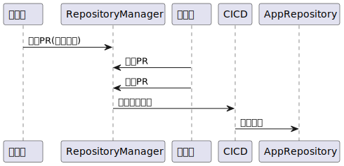
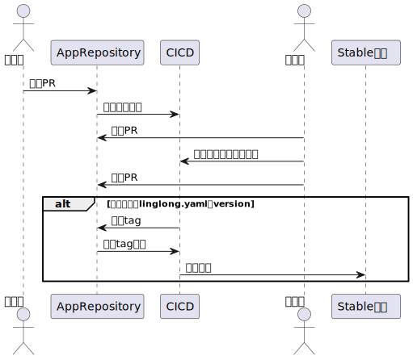

# linglongdev 仓库管理

## 申请创建应用仓库

开发者向 github 中 linglongdev 组织下的 [Repository-Manager](https://github.com/linglongdev/Repository-Manager) 项目提交 PR，更新 repos.yaml 文件来申请创建应用仓库。

请在 repos.yaml 文件添加以下内容然后，提交 Pull Request

```yaml
- repo: 仓库名(应使用倒置域名格式, 例如 org.deepin.calendar )
  info: 应用简介
  developer: 开发者github用户名
```

等待 PR 合并后，将会自动在 linglongdev 组织下创建该仓库

> [!TIP]
> 为避免多个 PR 冲突，在 PR 合并后 repos.yaml 会被清空，历史提交请查看 history/repos_history.yaml

<!--
@startuml
开发者 -> RepositoryManager: 提交PR(创建仓库)
管理员 -> RepositoryManager: 审查PR
管理员 -> RepositoryManager: 合并PR
RepositoryManager -> CICD: 触发仓库创建
CICD -> AppRepository: 创建仓库
CICD -> AppRepository: 设置OBS的webhook
@enduml
 -->



## 应用仓库管理

1. 开发者向应用仓库以 PR 方式修改 linglong.yaml 文件
2. PR 会触发自动化构建，在 PR 下面会贴出 layer 文件的下载地址，等待构建完成后可下载对应的 layer 文件
3. 如果 PR 更改了 linglong.yaml 里面的版本号，在 PR 合并后会自动创建 tag
4. 创建 tag 会触发自动化构建，构建完成后会推送应用到外网玲珑仓库



<!-- ```plantuml
@startuml
actor 开发者
开发者 -> AppRepository: 提交PR
AppRepository -> OBS: 触发测试构建
alt 目前没有构建完成的事件，只能提前拼下载地址
AppRepository -> CICD: 触发PR事件
CICD -> AppRepository: 回复layer下载地址
end
actor 管理员
管理员 -> AppRepository: 审查PR
管理员 -> OBS: 下载构建结果进行测试
管理员 -> AppRepository: 合并PR

alt 如果修改了linglong.yaml的version
CICD -> AppRepository: 创建tag
AppRepository -> OBS: 触发tag构建
OBS -> Testing仓库: 推送应用
end
@enduml
``` -->

## CICD 工作流

- [x] 创建仓库
      根据 PR 的提交创建新仓库
- [x] 设置 OBS webhook
      给创建的新仓库添加 OBS 的 webhook
- [x] 创建 PR 后触发 OBS 构建
      通过 webhook 触发 OBS 构建玲珑应用
- [x] 在 PR 下面回复 layer 的下载地址
      在构建成功后能在下载地址里看到构建出的 layer 文件
- [x] 修改 linglong.yaml version 字段 自动发布 tag
      在修改 version 字段的 PR 合并后自动发布 tag,tag 号和 version 一致
- [x] 多个 linglong.yaml 文件检查保持 version 一致
      在 PR 构建的时候检查多架构多 linglong.yaml 文件的 version 版本号要一致
- [x] 发布 tag 后 触发 OBS 构建
      通过 webhook 触发 OBS 构建玲珑应用
- [ ] tag 构建后推送 layer 到仓库
      OBS 构建完成后触发 publish 脚本，publish 脚本推送 layer 到线上仓库

**由于测试人力短缺，无法及时对每个应用做测试，已暂停推送layer到线上仓库的步骤** 应用打包者可分发构建的layer文件或前往 https://www.chinauos.com/partner/distribute 投递应用
